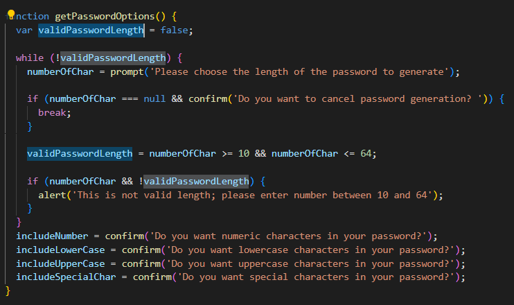
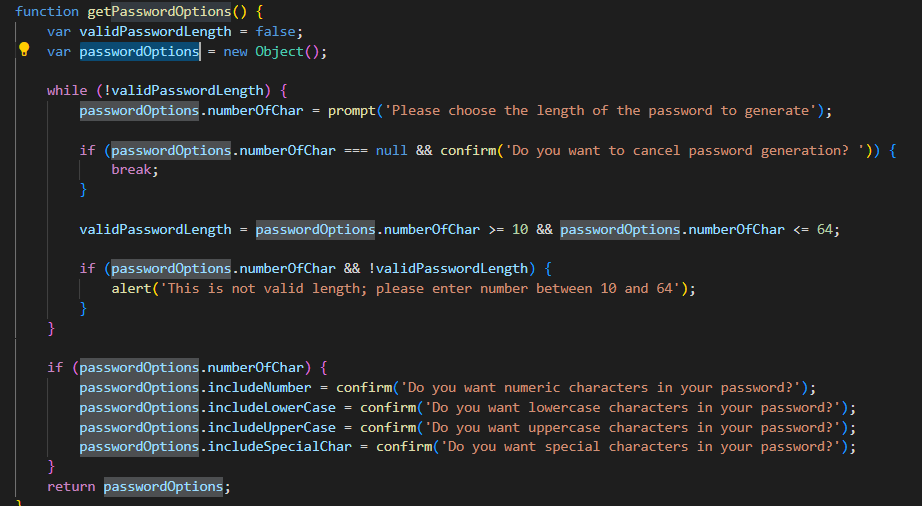
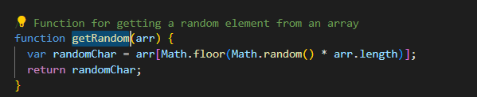
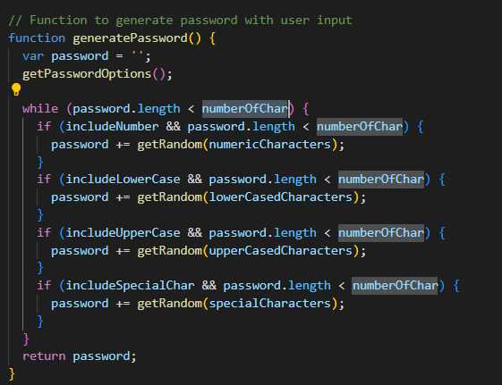

# Password-Generator
## Description
* Global variable declaration and initialisation
Here I created global variables and set it to false to get accessed by functions that I have used in this program to generate password.

* Function getPasswordOptions
Here I declared variable validPasswordLength and set it to false and used while loop for prompting the user for number of characters to generate password. I validated the input by using if statements to check input for number of characters. Number of characters should be between 10 and 64. Created true condition with assigning it to validPasswordLength and also set false condition if number of characters null or less than 10 or more than 64. It either prompts the user to enter number or cancel and if user cancels then it breaks out of the loop.

Then used confirm statement to include numeric, lowercase, uppercase and special characters.

I have also shown alternative method in script-with-obj by using object.
I created object called passwordOptions and used this object throughout the function to avoid uasage of global variables.

* Function getRandom
This function is used to select random characters from  numeric, lowercase,uppercase and special characters array.

* Function generatePassword
In this function I declared empty string password and called getPasswordOptions function to get its output.
Used while loop to get random characters from numeric, lowercase, uppercase and special characters array and appended to password to create passward of desired length. Here I set password length less than numberOfChar so that while loop to iterate that many times to get exact length the user wishes to create and returned password string containing random numeric, lowercase,uppercase and special characters with desired length. I set numberc, lowercase, uppercase, special characters and password length to be less than number of characters so that once it reaches exact number of characters the condition will get false and it will break out of the loop.

In script-with-obj I created new variable returnPwdOptions and assigned to function call getPasswordOptions() and used this variable in while loop to set password length less than number of characters to true and also used to check conditions like numbers, lowercase, uppercase and special characters and password length to be set less than number of characters and appended to password to get exact length.

Finally this password that returned by function generatePassword is used to display on screen once the generate button has been clicked.

### The URL of the deployed application

### The URL of the GitHub repository that contains my code

https://github.com/Nandanippani/Password-Generator

## Installation

N/A

## Usage

This project is used to demonstrate ability to use functions, return variables, while loop and global variables.

## Credits

N/A

## License

Please refer to the LICENSE in the repo.

