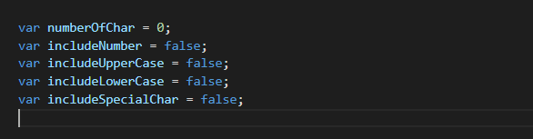

# Password-Generator
## Global variable declaration and initialisation
Here I created global variables and set it to false to get accessed by functions that I have used in this program to generate password.

## Function getPasswordOptions
Here  declared variable validPasswordLength and set it to false